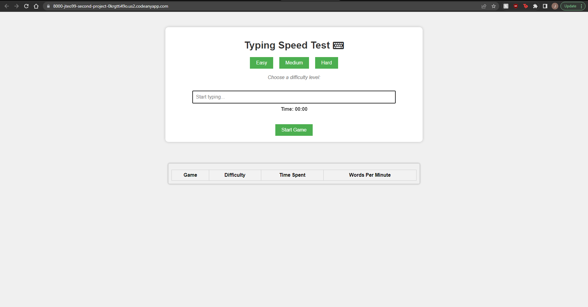
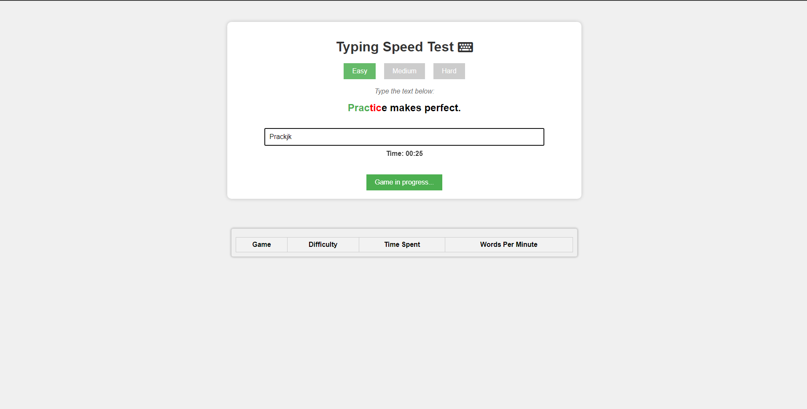
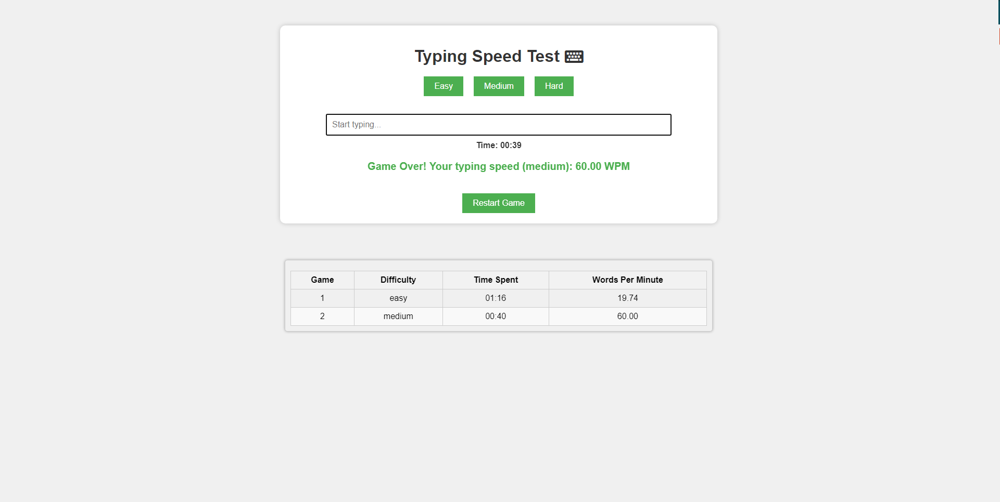
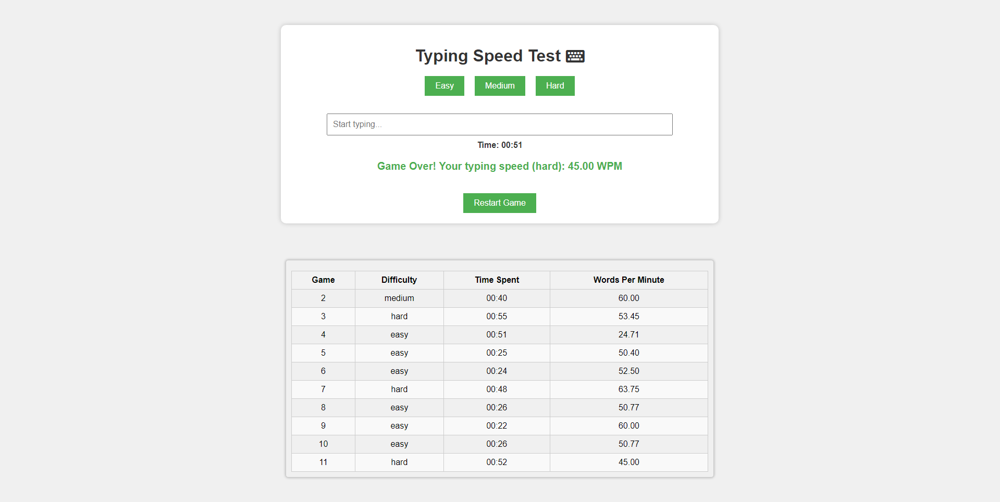
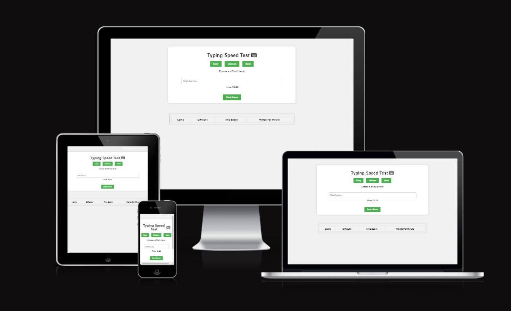
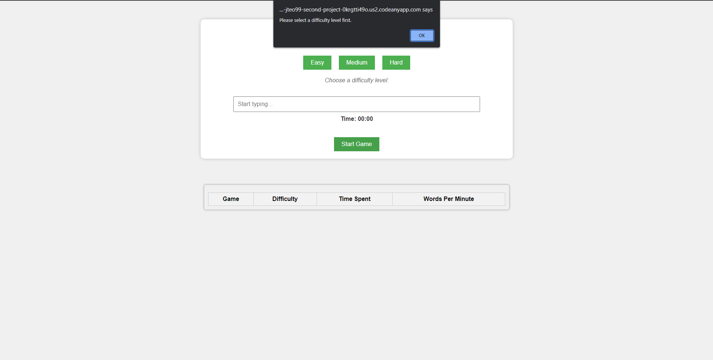
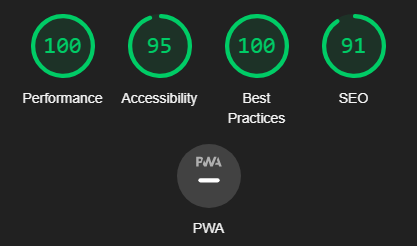

# Typing Challenge Game

Welcome to the Typing Challenge Game! This is a web-based game that tests and improves your typing skills. The game provides various levels of difficulty for you to choose from and challenges you to type random sentences as quickly and accurately as possible.

## How to Play

1. Select a Difficulty Level:
   - Easy
   - Medium
   - Hard

2. Click the "Start Game" button to begin.

3. Type the displayed sentences as accurately and quickly as possible.

4. The timer will measure how long it takes you to complete the sentences.

5. Once you've finished all the sentences, your typing speed in Words Per Minute (WPM) will be displayed.

6. You can view your game history, including difficulty, time spent, and WPM, in the "Game History" section.

7. You can restart the game by clicking the "Restart Game" button.

## Features

- Three difficulty levels to choose from: Easy, Medium, and Hard.
![Front page])

- Timer displays the time spent in a 00:00 format.

- Real-time feedback on your typing accuracy.

- Game history tracking for your performance. End of game results also displays Words per minute (wpm) and the difficulty level to track information and the timer is stopped.

- Responsive design for a great user experience on various devices.

- Indications as to the difficulty level and forces player to select by showing alert when no difficulty is selected.

- Background is separated from the game and history box containers and is coloured naturally and compliments each other. Green buttons stand out and allow the whole game to look brighter.
- Buttons are disabled when game starts to prevent confusing the software and so players do not accidentally cancel their game.

## Testing

- I have tested the page through the browsers: Chrome, safari, Microsoft Edge.
- I have confirmed the project is responsive and functions on all standard screen sizes using the Chrome developer tool functions and looks good in those screen sizes.
- I have checked that the buttons work as intended and that the intended functions are working properly.
- I have checked that the game is clear and concise in its contents and that items are easy to see and understand.

## Bugs

- When mistyping 'spacebar' key it is unclear within the error checking that the key has been mistyped as the function changes font color to red which is non visible with an invisible character. This is a limitation with the CSS as it will not allow me to highlight the spacing between the words creating a situation where we cannot check whether the spacing is correct.

## Validator Testing

- HTML - No errors returned through the official W3C validator.
- CSS - No errors returned through the official Jigsaw validator.
- JavaScript - No errors are returned through the official Jshint validator.
- Accessibility - I conform that the font is easy to read and there is good accessibility through the lighthouse devtool.

## Deployment

- The site has been deployed to GitHub pages. This was completed by accessing setting  on the GitHub Project page; clicking on the "pages" tab in the left panel; selecting the master (main) branch to select the /(root) folder; and launching as a website.
- The live link can be found using this link - [Typing Speed Game](https://jteo99.github.io/Second_Project/)

## Content

- Inspiration for this project has been from websites such as [Monkey Type](https://monkeytype.com/) and [10 Fast Fingers](https://10fastfingers.com/typing-test/english) as some typing tests that I have personally used in the past although the execution of the game is different.
- Inspiration for the timer was taken from [educative](https://www.educative.io/answers/how-to-create-a-countdown-timer-using-javascript).
- The keyboard icon used was from [Font Awesome](https://fontawesome.com/)
